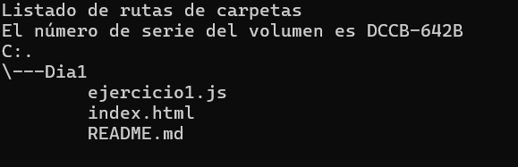

# Funciones y variables

Investigación e implentación de funciones y los tipos de variables en JavaScript

# Índice

1. [Estado del proyecto](#id1)
2. [Descripción del Proyecto](#id2)
3. [Tecnologías Utilizadas](#id3)
4. [Estructura del proyecto](#id4)
5. [Características](#id5)
6. [Diseño](#id6)
7. [Instrucciones](#id7)
8. [Personas Desarrolladoras del Proyecto](#id8)


# Estado del Proyecto<a name="id1"></a>

Finalizado

# Descripción del Proyecto<a name="id2"></a>

Este archivo contiene la resolución de 3 problemas con funciones, en JavaScript: 

1. Acorde con la edad de una perona, imprime el año en que nació. 

2. Función que toma un valor en grados celcius y los convierte a grados fahrenheit.

3. Hay un artículo en promoción, si el cliente está entre los 20 primeros clientes, tiene 30% de descuento y entre los primeros 50 clientes, un 10% de descuento. La función permite saber cuánto descuento tiene el cliente, según el orden en que llegó.

# Tecnologías utilizadas<a name="id3"></a>

* JavaScript

# Estructura del Proyecto



# Características<a name="id5"></a>

**index.html :** Archivo donde se realiza la conexión con el script.

**ejercicio1.js :** Archivo que contiene el código con la implementación de las funciones y variables en JavaScript

# Diseño<a name="id6"></a>

* Solo puede ser visto y usado en consola

# Instrucciones<a name="id7"></a>

1. Clonar el repositorio
~~~
https://github.com/JesusBustamante/JavaScript_BustamanteJesus.git
~~~

2. Si es clonado en Visual Studio Code, descargue la extensión Live Server.

3. Abre el archivo index.html con Live server dando click derecho sobre el archivo index.html, y seleccionando la opción Open With Live Server.

4. ```Ctrl + shift + i``` en el navegador. En el menú de opciones, seleccionar ```console```

# Personas Desarrolladoras del Proyecto<a name="id8"></a>

Este proyecto fue desarrollado por Jesús Leonardo Bustamante Ramírez, estudiante de Campuslands, como trabajo requerido para el módulo de JavaScript.